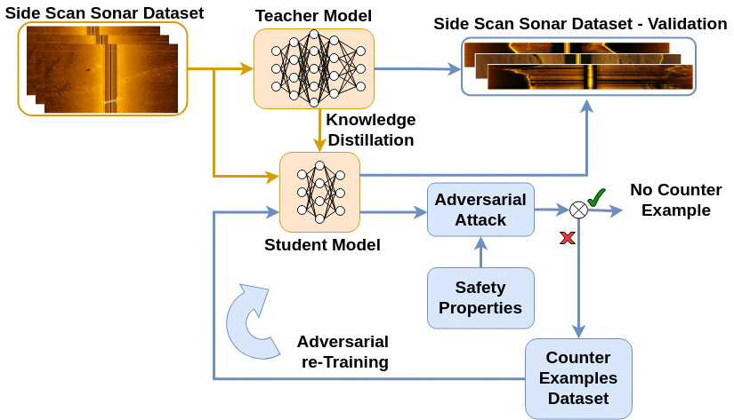

# ROSAR: Robust Sonar Adversarial Re-training

This repository contains the implementation of the ROSAR (robust sonar adversarial re-training) framework, which was introduced in our paper:

> Aubard, M., Antal, L., Madureiera, A., Teixeira, L. F., Ábrahám, E. (2024). ROSAR: An Adversarial Re-Training Framework for Robust Side-Scan Sonar Object Detection. Submitted to IEEE International Conference on Robotics and Automation (ICRA), 2025. IEEE. (paper under review).

<!--  -->

ROSAR is a novel framework enhancing the robustness of deep learning object detection models tailored for side-scan sonar (SSS) images, generated by autonomous underwater vehicles using sonar sensors. By extending our [prior work on knowledge distillation (KD)](https://github.com/remaro-network/KD-YOLOX-ViT), this framework integrates KD with adversarial retraining to address the dual challenges of model efficiency and robustness against SSS noises. 

We introduce three novel, [publicly available SSS datasets](https://zenodo.org/records/13692547), capturing different sonar setups and noise conditions. We propose and formalize two SSS safety properties and utilize them to generate adversarial datasets for retraining. Through a comparative analysis of projected gradient descent (PGD) and patch-based adversarial attacks, ROSAR demonstrates significant improvements in model robustness and detection accuracy under SSS-specific conditions, enhancing the model's robustness by up to 1.85%.

If any of this work has been useful in your research, please consider citing us 😃.

## Setup (tested under Ubuntu 20.04)

1. Clone the repository:
`git clone --recursive https://github.com/remaro-network/ROSAR-framework.git`

2. Setup conda environment:
```
# Change current working directory to ROSAR repository
cd ROSAR-framework

# Remove the old environment, if necessary.
conda deactivate; conda env remove --name ROSAR-framework

# install all dependents into the environment
conda env create -f alpha-beta-CROWN/complete_verifier/environment.yaml --name ROSAR-framework

# activate the environment
conda activate ROSAR-framework
```

## Example usage

### Generate and attack robustness properties

1. Generate robustness property
```
# Assuming that the current working directory is the main directory of ROSAR
python generate_P1.py ./data/Compressed_SSS400.png 0 0.10
```

2. Copy the safety property into the alpha-beta-CROWN tool
```
# Copy the instances.csv file
cp instances.csv ./alpha-beta-CROWN/complete_verifier/models/yolox/

# Copy the vnnlib file
cp ./vnnlib/Compressed_SSS400_perturbed_bbox_0_delta_0.1.vnnlib ./alpha-beta-CROWN/complete_verifier/models/yolox/vnnlib/
```
3. Run the tool
```
# Change directory and run the tool
cd alpha-beta-CROWN/complete_verifier
python abcrown.py --device cpu --config exp_configs/yolox/yolox.yaml --show_adv_example
```

(optional) 4. Generate instance of the other property
```
# Assuming that the current working directory is the main directory of ROSAR
python generate_P2.py ./data/Compressed_SSS400.png 0 0.25
```

(optional) 5. Copy the safety property into the tool
```
# Copy the instances.csv file
cp instances.csv ./alpha-beta-CROWN/complete_verifier/models/yolox/

# Copy the vnnlib file
cp vnnlib/img_Compressed_SSS400_black_lines_0_min_delta_0.25.vnnlib alpha-beta-CROWN/complete_verifier/models/yolox/vnnlib/
```

(optional) 6. Run the tool
```
cd alpha-beta-CROWN/complete_verifier
python abcrown.py --device cpu --config exp_configs/yolox/yolox.yaml --show_adv_example
```

### To measure the adversarial robustness bound of the model

1. Set the target model name in the `config.py` file
```
MODEL_NAME = 'KD_yolox_nano_L_ViT.onnx'
```

2. Set the shell variable `ROSAR_HOME` to the main directory of ROSAR
```
export ROSAR_HOME=<some_directory>/ROSAR-framework
```

4. Start the binary search for finding the adversarial robustness bound of all input instances
```
./P1_binary_adv_bound.sh
```

5. Adversarial examples during the binary search are saved into the `alpha-beta-CROWN/complete_verifier/adv_examples` sub-directory.

6. The script generates a `statistics_<T>.csv` file that contains the result of the adversarial attack for different robustness bounds. (This process might take some time!)

7. To generate the raincloud plots one can use the available `statistics_<T>.csv` files and the `analyize.py` script. This assumes that all three models (base, pgd-retrained, patch-retrained) were analyzed with respect to both P1 and P2 properties.
```
python analyze.py statistics_<T1>.csv statistics_<T2>.csv statistics_<T3>.csv statistics_<T4>.csv statistics_<T5>.csv statistics_<T6>.csv
```

## Acknowledgements

This work is part of the Reliable AI for Marine Robotics (REMARO) Project. For more info, please visit: https://remaro.eu/

[](https://remaro.eu/)

<a href="https://research-and-innovation.ec.europa.eu/funding/funding-opportunities/funding-programmes-and-open-calls/horizon-2020_en">
    
</a>

This project has received funding from the European Union's Horizon 2020 research and innovation programme under the Marie Skłodowska-Curie grant agreement No. 956200.
